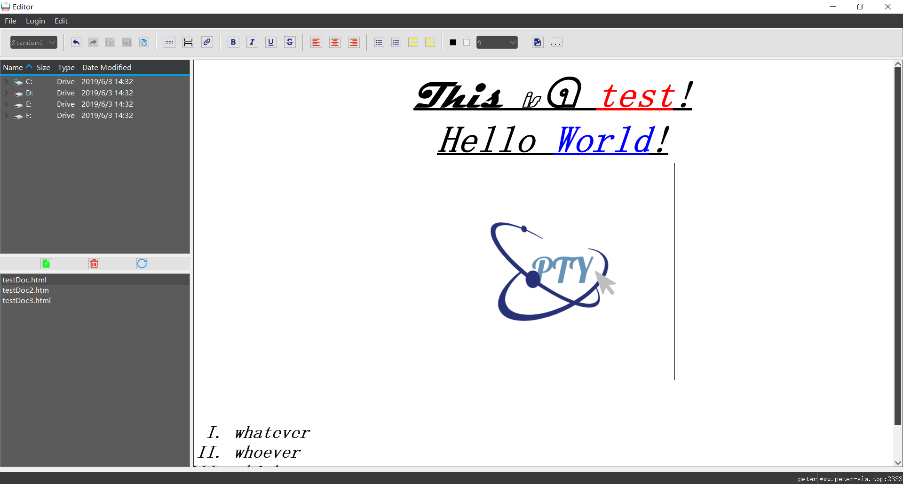
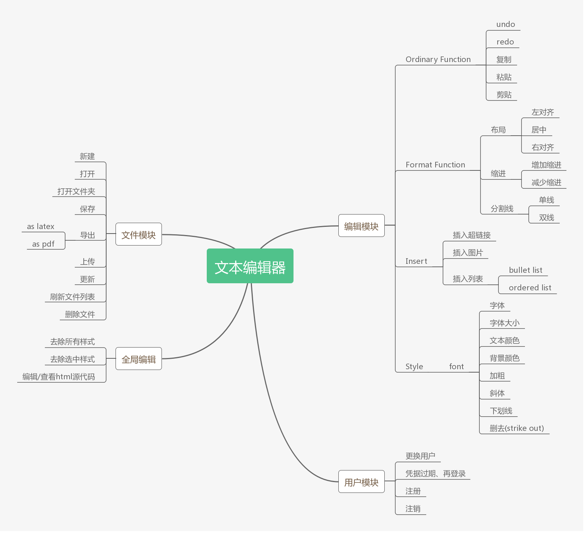
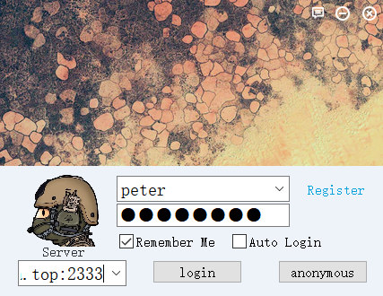

<h2 align="center">Qtexteditor</h2>

一个qt制作的在线富文本编辑器，可用于在线多人协作编辑文本，支持导出html，pdf，latex格式。
A Qt rich text editor, used for online or offline edit text. Support for exporting to .html, .pdf, .tex.

## Function

- Function
    - User Administration
        - Login
        - Register
    - Rich Text Function
        - format
        - font style
        - insert link
        - insert image
        - other common-use operation
    - File Fuction
        - save as html
        - export to latex
        - export to pdf
        - upload file to remote server
        - get file from remote server
        - delete file stored in remote server

## Login Module

## Usage

- First Sign Up for An Account(press register button and then )
- Check Your Email to Activate Your Account
- Sign in with a server address(default server:www.peter-sia.top:2333)

## For Developer

- Use Qt embeded SQLite to store username and password which you have typed before
- Use Qt Network to communicate with remote server
- You can deploy your own server to your local enviroment or production environment, deploy your server according to [Server Project](https://github.com/PTYin/Qt-TextEdit-Server)

### Support Cmake Project instead of QMake Project

CMakeLists.txt should be like that

    cmake_minimum_required(VERSION 3.13)
    project(QtLaTeX)
    
    set(CMAKE_CXX_STANDARD 14)
    
    set(CMAKE_PREFIX_PATH E:/Qt/Qt5.12.3/5.12.3/mingw73_64)
    # Find includes in corresponding build directories
    set(CMAKE_INCLUDE_CURRENT_DIR ON)
    # Instruct CMake to run moc automatically when needed
    set(CMAKE_AUTOMOC ON)
    # Create code from a list of Qt designer ui files
    set(CMAKE_AUTOUIC ON)
    
    # Find the QtWidgets library
    find_package(Qt5 COMPONENTS Core Widgets Gui Sql Network PrintSupport REQUIRED)
    
    # Populate a CMake variable with the sources
    set(SOURCELIST
            src/login.ui
            src/login.cpp
            src/login.h
            src/main.cpp
            src/passwdedit.ui
            src/passwdedit.cpp
            src/passwdedit.h
            src/register.ui
            src/register.cpp
            src/register.h
            src/systemtrayicon.cpp
            src/systemtrayicon.h
            src/mtextedit.cpp
            src/mtextedit.h
            src/AccountManager.cpp
            src/AccountManager.h
            src/editor.cpp
            src/editor.h)
    qt5_add_resources(SOURCELIST resources/lang.qrc resources/myqrc.qrc resources/qss.qrc)
    message("${PROJECT_BINARY_DIR}")
    file(MAKE_DIRECTORY ${PROJECT_BINARY_DIR}/plugins)
    file(COPY plugins/htmltolatex.jar DESTINATION ${PROJECT_BINARY_DIR}/plugins/)
    file(COPY plugins/config.xml DESTINATION ${PROJECT_BINARY_DIR}/)
    # Tell CMake to create the QTLaTeX executable
    add_executable(QtTextEditor ${SOURCELIST} myapp.rc)
    #add_executable(test test/main.cpp test/A.cpp test/A.h)
    #file(MAKE_DIRECTORY )
    # Use the Widgets module from Qt 5
    target_link_libraries(QtTextEditor Qt5::Widgets Qt5::Core Qt5::Gui Qt5::Sql Qt5::Network Qt5::PrintSupport)

- You can also use qmake, but remember to copy the directory plugins to your build directory and copy the config.xml in plugins to your build root